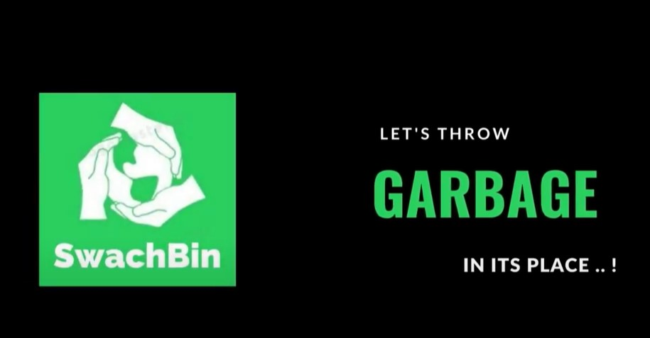

# SWACHBIN 

## Contents
1. [Short Description](#short-description)
1. [Demo Video](#demo-video)
1. [The Architecture](#architecture-overview)
1. [Long Description](#long-description)
1. [Project Roadmap](#project-roadmap)
1. [Live demo](#live-demo)
1. [Addtional Video links](#Additional-video-demo-links)
1. [Built With](#built-with)
1. [The Team](#team)
1. [License](#license)
1. [Acknowledgments](#acknowledgments)

## Short description 
SwachBIN (inspired from Hindi - swach indicates cleanliness) - a smart AI powered trash bin that solves the waste / trash segregation menace at the source in a seamless way and at the same time accomplishes the task at ultra-low cost and by enabling sustainability.

### What's the problem?
Due to rapid urbanisation, the countries like India are facing a massive waste management challenge. In India alone over 377 million urban people live in 7,935 towns and cities and generate 62 million tonnes of municipal solid waste per annum but only 43 million tonnes (MT) of the waste is collected, 11.9 MT is treated and 31 MT is dumped in landfill sites[(source)](https://www.downtoearth.org.in/blog/waste/india-s-challenges-in-waste-management-56753). Solid Waste Management (SWM) is one among the basic essential services provided by municipal authorities in the country to keep urban centres clean. However, municipal bodies are increasingly getting overwhelmed and almost all municipal authorities deposit solid waste at a dumpyard within or outside the city haphazardly. 

One of the key reasons being "segregation at source" is not happening properly. One might ask how about enforcing the law. For instance, in India, various legislations exists for regulating the manner of disposal and dealing with generated waste under the umbrella law of Environment Protection Act, 1986 (EPA) but still landfills are getting dumped with mixed waste a lot leading to pollution.

No matter how strict the laws are there until unless the citizens across the social strata are educated properly on how to deal with generated waste, laws and legislations will exist only in paper.

In simple words, the problem that we have in our hand is - "Not able to segregate waste at source" 
### The idea
The idea is to build a smart trash bin which identifies and detect the trash and perform classification based on AI algorithm. The bin will automatically detect the trash as:
- Recycle (wet and dry) or
- Non recycle trash  (Hazardous, Sanitary, Construction and Debris)

and open the trash can accordingly. 

It is equipped with Raspberry Pi and is connected to a camera that take a picture of the trash. With the help of state of the art AI and ML algorithms, the system predicts the trash and classifies the image accordingly, based on the result, an electrical signal is given to the servo motor to rotate which in turn opens the trashcan lid either to left or right depending on the results of recyclable or non recyclable.

Through our solution, we are automating the segregation process which is more efficient than the manual processes. Per our research, currently there exists no products like this in existence that we know of -- there are only standard automated recycling machines, which do not come equipped with an AI solution to classify what goes where, so we think it would be a valuable product to create in order to improve efficiency in our society's waste management system.

Once the waste is segregated within the bin, the level of trash is being monitored in real time by an ultrasonic sensor. Once the 'set' threshold reaches, the ultrasonic sensor will notify the municipal corporation so that they can plan a visit to pick the trash.
This way, we are reducing the carbon emissions to a greater extent and promoting *sustainability*

Above all, it is affordable due to it's ultra low cost and when manufactured and deployed in enmasse the cost will further come down.

### How can technology help?
Due to the infusion of AI / ML and advanced HW - it is possible to detect the type of trash with high accuracy and also through the use of NLP (Text to Speech) we can educate the user as well on the type of waste they are disposing. 
Through our research we found that no solution exits presently that is a combination of highly tech enabled yet highly affordable.

Also through advanced analytics and IoT platform based dashboard, government bodies can plan their trash picking schedule effectively thus enabling 'reduced carbon emissions'.
- Less trips to households to pick waste = less fuel being burned = reduced carbon emission ..yay :)

## Demo video

## Architecture Overview

    1. The waste material / trash is presented in front of the camera that is connected to the SwachBin (powered by Raspberry Pi.)
    2. The captured image of the waste is sent to the Raspberry Pi.
    3. AI Engine at the processes the image and identifies the class of the trash and the category it belongs to. We used Resnet algorithm, winner of multiple algorithm related comepetitions, can have a very deep network of up to 152 layers by learning the residual representation functions instead of learning the signal representation directly.
    4. Depending on the classification, the AI engine sends the corresponding signal to the servo motor, to open the respective lid of the bin.
    5. Classification details are further stored in the SQL database. 
    6. Activity details gets updated in the Docker container.
    7. Depending on the class type of the trash, the LED indicator is turned ON and the speaker conveys the same information as a voice message to the user.
    8. The ultrasonic sensor senses the trash level and sends the information to the flask app to be displayed in the dashboard.
    9. All the information gets displayed in the IoT dashboard.
## Long description
For the development of SwachBIN we followed a two pronged approach:
1. Finding out "The What" by using design thinking based approach and 
2. Finding out "The How" by Technology Level Readiness (a development methodology popularised by NASA).
### Design Thinking in Play:

At first, we did a value proposition analysis and identified two types of users:
1. Citizen User - a person who uses a trash bin at source (like household / shop / school etc)
2. Community worker - a person who picks the trash and transports it to the waste disposal center

We interviewed both types of users and understood their "pains".

**Major Pains**:
- Citizen user: Finds it difficult to understand the types of waste hence many times they gets frustrated and put the trash in a bin that is not meant for a particular type of trash.
- 
    ---Result: They often get penalised monetarily for not segregating the trash properly
- Community worker: Gets overwhelemed by the trash getting mixed.
- ---Result: Risking their health due to toxins getting created by mixed waste; mixed waste ends up in environment (like landfills, waterbodies etc) causing serious and irrevesible pollution.

Armed with above information, we went back to the drawing board; did further research on what "gains" we can provide through our solution and came up with the following vision: **SwachBIN** - an end to end open-source platform which when installed will provide the following "gains":

**Major Gains:**
* Solve the problem of “segregation at source” in a seamless manner 
* Educate the user about the type of waste they are disposing
* Enables compliance with local / regional segregation rules and regulations
* Ultra low cost yet sophisticated
* Aligns with UN goal of sustainability 
### Technology Level Readiness based development:
Technology Readiness Levels (TRL) are a type of measurement system used to assess the maturity level of a particular technology project where in it is evaluated against the parameters for each technology level and is then assigned a TRL rating based on the projects progress. There are nine technology readiness levels. TRL 1 is the lowest and TRL 9 is the highest. [(source)](https://www.nasa.gov/directorates/heo/scan/engineering/technology/technology_readiness_level)

 
 Image Credit: NASA 

We planned our project based on these 'nine' levels wherein we have acheived all the nine levels and are ready to move ahead with full fledged product launch. One can see how the development shaped up by going through our project development phase by looking into ["Development Memories"](https://github.com/CFC2k22Organisation/SwachBin-Main/tree/main/Development%20Memories)
## Features
1. All in one bin (can collect and segregate five types of trash)
2. IoT dashboard helps in reducing carbon emissions by helping the municipal body to plan trips to households on need basis
3. Ultra low cost (the HW components are easily available in market and at low cost and when produced enmasse the cost will futher come down)
4. Highly portable
5. Educates the user by explaining the type of trash they disposed by using Text-To-Speech
6. Uses state of the art tech - AI, computer vision, IoT to name a few
7. Uses 'responsible' & 'ethical' AI practices by maintaining transparency and accountability throughout

**Key Modules of swachBin:**
1. Hardware based front end
2. AI driven middle ware
3. IoT and SQL infused backend

## Project roadmap

## Built with

## Installation
* PowerUp the builtin Raspberry Pi module by connecting it to a power socket
* Connect the Raspberry Pi to a WiFi / Mobile Hotspot

## Getting started
* Using the RaspController App / vnc viewer software (or similar) login into the Pi and run the executable code
* Get a trash near to the SwachBIN camera and see it springing into action

## Live Demo
[IoT Realtime Dashboard Demo](http://169.51.206.185:31539/)
## Additional Video Demo links 
- [Real time testing by a Next Generation citizen](https://www.youtube.com/watch?v=YwTdrX-UwUI&t=2s)
- [A fun filled stop motion featurette](https://www.youtube.com/watch?v=bVE5bX-MVnE)
- [Features of SwachBIN](https://www.youtube.com/watch?v=XjuxM3jG6so&t=27s)

## Team
- [Bharathi Athinarayanan](https://github.com/rathisoft) - _Product owner & AI / ML architect_ 
- [Suneetha Jonnadula](https://github.com/Sunivihaan) - _Lead Full stack developer_
- [Prashanth P](https://github.com/Prashanthp) - _Principal Application developer_
- [Mohamed Fazil](https://github.com/Fazil-24) - _AI / ML Development Engineer_

## License
This project is licensed under the Apache 2 License - see the [LICENSE](LICENSE) file for details.

## Acknowledgments
We partnered with [BBMP(Bruhat Bengaluru Mahanagara Palike)](https://site.bbmp.gov.in/indexenglish.html), Bengaluru's municipal governing body. BBMP helped us in identifying the types of trash that the citizens need to segregate and using their [inputs](https://site.bbmp.gov.in/documents/waste-notice.pdf) we created our own 'real' dataset. 

